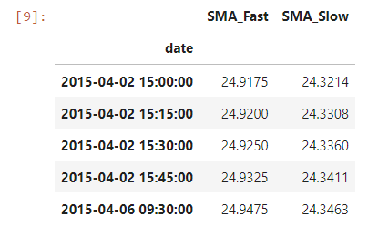

# Algorithmic_Trading_Bot
Combining algorithmic trading with financial Python programming and machine learning to create an algorithmic trading bot that learns and adapts to new data and evolving markets.

---

## Technologies

This project leverages python 3.7 with the following packages:

**[Pandas Library](https://pandas.pydata.org/)** - pandas is a fast, powerful, flexible and easy to use open source data analysis and manipulation tool,
built on top of the Python programming language.<br>

**[Numpy Library](https://numpy.org/)** - NumPy offers comprehensive mathematical functions, random number generators, linear algebra routines, Fourier transforms, and more.<br>

**[Pathlib Library](https://pathlib.readthedocs.io/en/pep428/)** - This module offers a set of classes featuring all the common operations on paths in an easy, object-oriented way.<br>

**[HvPlot Library](https://hvplot.holoviz.org/)** - A high-level plotting API for the PyData ecosystem built on HoloViews.<br>

**[MatPlotLib Library](https://matplotlib.org/)** - Matplotlib is a comprehensive library for creating static, animated, and interactive visualizations in Python.<br>

**[SkLearn SVM Library](https://scikit-learn.org/stable/modules/generated/sklearn.svm.SVC.html)** - C-Support Vector Classification.<br>

**[SkLearn.preprocessing Standard Scaler](https://scikit-learn.org/stable/modules/generated/sklearn.preprocessing.StandardScaler.html)** - Standardize features by removing the mean and scaling to unit variance.<br>

**[Pandas DateOffset Library](https://pandas.pydata.org/pandas-docs/stable/reference/api/pandas.tseries.offsets.DateOffset.html)** - Standard kind of date increment used for a date range.<br>

**[SkLearn Classification Report Library](https://scikit-learn.org/stable/modules/generated/sklearn.metrics.classification_report.html)** - Build a text report showing the main classification metrics.<br>

**[SkLearn LogisticRegression Library](https://scikit-learn.org/stable/modules/generated/sklearn.linear_model.LogisticRegression.html)** - Logistic Regression (aka logit, MaxEnt) classifier.<br>

---

## Usage

To use the Venture Capital Neural Network application, simply clone the repository and run the Jupyter Notebook **machine_learning_trading_bot.ipynb** either in VSC, or in Jupyter Lab.

Step 1: Imports

```python
# Imports
import pandas as pd
import numpy as np
from pathlib import Path
import hvplot.pandas
import matplotlib.pyplot as plt
from sklearn import svm
from sklearn.preprocessing import StandardScaler
from pandas.tseries.offsets import DateOffset
from sklearn.metrics import classification_report
from sklearn.linear_model import LogisticRegression
```

Step 2: Import the OHLCV dataset into a Pandas DataFrame.

The following image displays the output of this step:


Step 3: Filter the date index and close columns and use the pct_change function to generate  returns from close prices.

The following image displays the output of this step:


Step 4: Set the short window and long window and generate the fast and slow simple moving averages (4 and 100 days, respectively).

The following image displays the output of this step:


Step 5: Initialize the new Signal column. When Actual Returns are greater than or equal to 0, generate signal to buy stock long. When Actual Returns are less than 0, generate signal to sell stock short.

The following image displays the output of this step:


Step 6: Calculate the strategy returns and add them to the signals_df DataFrame.

The following image displays the output of this step:


Step 7: Plot Strategy Returns to examine performance.

The following image displays the output of this step:


Step 8: Assign a copy of the sma_fast and sma_slow columns to a features DataFrame called X.

The following image displays the output of this step:



Step 9: Create the target set selecting the Signal column and assiging it to y.

The following image displays the output of this step:


Step 10: Select the start of the training period.

The following image displays the output of this step:


Step 11: Select the ending period for the training data with an offset of 3 months.

The following image displays the output of this step:


Step 12: Generate the X_train and y_train DataFrames.

The following image displays the output of this step:


Step 13: Generate the X_test and y_test DataFrames

The following image displays the output of this step:


Step 14: Scale the features DataFrames

```python
# Create a StandardScaler instance
scaler = StandardScaler()

# Apply the scaler model to fit the X-train data
X_scaler = scaler.fit(X_train)

# Transform the X_train and X_test DataFrames using the X_scaler
X_train_scaled = X_scaler.transform(X_train)
X_test_scaled = X_scaler.transform(X_test)
```

Step 15: Use the SVC classifier model from SKLearn's support vector machine (SVM) learning method to fit the training data and make predictions based on the testing data. Review the predictions.

The following image displays the output of this step:


Step 16: Review the classification report associated with the SVC model predictions.

The following image displays the output of this step:


Step 17: Create a predictions DataFrame that contains columns for “Predicted” values, “Actual Returns”, and “Strategy Returns”.

The following image displays the output of this step:


Step 18: Create a cumulative return plot that shows the actual returns vs. the strategy returns. Save a PNG image of this plot. This will serve as a baseline against which to compare the effects of tuning the trading algorithm.

The following image displays the output of this step:


Step 19: Tune the training algorithm by adjusting the size of the training dataset.

The following image displays the output of this step:


Step 20: Analyze the performance of the Adjusted Training Set Model

What impact resulted from increasing or decreasing the training window? First and foremost, it seems as if though the model with the adjusted training set performed just a little better than the original model. In this version of the model, we adjusted the training set from 3 months to 6 months. The accuracy of the original model was 55%, and this adjusted model had anaccuracy of 56%. As we are talking about finance, that 1% can make a huge difference. From the plots we can see that the predicted and actual returns were better using this adjusted model. The original model had an actual return of close to 1.4 times our investment, and a predicted return right around the 1.5 times our investment. However, the tuned model had an actual return of around 1.5 times our invested capital and predicted returns in the neighborhood of 1.8 times our investment. So it is clear that the Training Set Adjusted Model (Model 2), with 3 more months of training data, outperforms the original model.

Step 21: Tune the trading algorithm by adjusting the SMA input features.

The following image displays the output of this step:


Step 22: Analyze the performance of the Adjusted SMA Model

What impact resulted from increasing or decreasing either or both of the SMA windows? This "Adjusted SMA Model" does seem to outperform the original model with an accuracy of 56%, compared to 55% for the original model. We adjusted both SMA windows from short-4/long-100 to short-8/long-200. This was the only model where strategy return was lower than actual return. Also, this model provided the biggest discrepencies between the actual returns and the strategy returns as both lines tend to be further apart when compared to the other 2 models. When comparing across all 3 models, it it clear that the second model "Adjusted Training Set" does the best out of all 3 in terms of cumulative returns. The original model and this third model "Adjusted SMA Model" both hover around the 1.5 times our investment. In contrast, the 2nd model (Adjusted Training Set) returns around 1.8 times our investment. This model is clearly the winner.

Step 23: Initiate a Logistic Regression model instance

```python
logistic_regression_model = LogisticRegression()
```

Step 24: Fit the model using the training data. Use the testing dataset to generate the predictions for the new model.

The following image displays the output of this step:


Step 25: Analyze the performance of the LR Model

Did this new model perform better or worse than the provided baseline model? Did this new model perform better or worse than your tuned trading algorithm? This algorithm performed worse, overall, than the baseline (Original) model. The original model has an accuracy of 55%, while this model has an accuracy of 52%. It obviously underperformed the tuned algorithm then. The tuned algorithm had the best performance overall. The tuned algorithm had an accuracy of 56%, so even better than the baseline model. One interesting observation however, is that this LR model seems to do much better in recalling the -1 class. So when we need to exit, this strategy performs better, but it really underperforms the other 2 models when it comes to the 1 class, or when to enter a trade. I would still choose my tuned model to execute my strategy. (The Adjusted Training Set Model).

Step 26: Use a classification report to evaluate the model using the predictions and testing data.

The following image displays the output of this step:


Step 27: Create a predictions DataFrame. Add the LR model predictions to the DataFrame. Add the actual returns to the DataFrame. Add the strategy returns to the DataFrame.

The following image displays the output of this step:


Step 28: Plot the actual returns versus the strategy returns.

The following image displays the output of this step:


Step 29: Analyze the LR Model Returns

As we can see with this latest model (LR Model), the strategy returns underperformed the tuned model. This strategy had a return of 1.15 times our capital, which is considerably less than the 1.8 times our investment with our tuned model.

---

## Contributors

**Created by:** Tony Landero<br>
**Email Adress:** mr.landero@gmail.com

---

## License

MIT